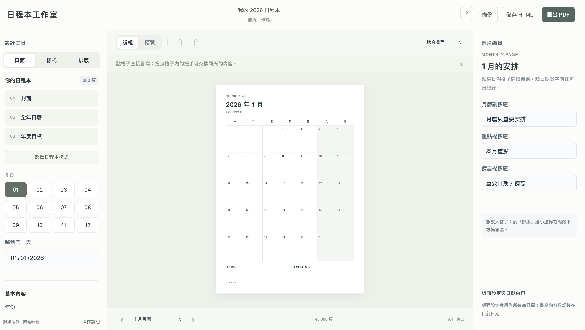

# 日程本工作室 · Planner Maker

把計畫寫下，把日子留下。

在瀏覽器裡設計自己的日程本：挑選版型、安排月曆、記錄每天的生活，再匯出成可列印或匯入筆記軟體的 PDF。無需安裝或註冊，下載單一 HTML 檔案就能離線使用，編輯與檔案產生都在你的裝置上完成。

**[立即使用線上版](https://bruce762.github.io/Planner-Maker/planner_studio.html)** · [離線使用方式](#離線使用) · [儲存與備份](#儲存與備份)



## 你可以做什麼

- **製作整年的日程本**：設定年份、名稱與封面文字，搭配全年日曆、年度目標、月曆和每日紀錄。
- **設計自己的風格**：五套版型、八組配色，還能調整各項顏色、字體風格、文字大小與書寫行距。
- **調整紙張與排版**：支援 A4、A5、Letter 直式紙張，可設定邊界、每週起點，以及月曆與每日頁的排列順序。
- **自訂每日頁**：選擇雙欄、寬時間軸或全頁筆記；新增、複製、改名與排序紀錄區塊，搭配橫線、點陣、空白或待辦格底紋。
- **直接編輯與拖曳**：點選紙面輸入文字，拖曳區塊調整順序、拖動欄間分隔線調整寬度，也能交換月曆中兩天的內容。
- **匯出與繼續編輯**：預覽 PDF 版面，依需要匯出整本、月份或單頁；透過 JSON 備份或包含內容的 HTML 保存成果。

### 五套版型

| 版型 | 特色 |
| --- | --- |
| 經典 | 清楚實用的日常版面 |
| 刊物 | 明體字形與分明的文字層次 |
| 留白 | 開放格線與寬裕的書寫空間 |
| 秩序 | 數字標記與俐落結構 |
| 柔光 | 柔色分區與圓角書寫區 |

切換版型會保留書寫內容與自訂區塊，套用後也能繼續調整。

## 開始使用

1. 開啟[線上版](https://bruce762.github.io/Planner-Maker/planner_studio.html)，或使用下載的 HTML 檔案。
2. 在左側「頁面」設定年份、日程本名稱與年度目標。
3. 到「樣式」挑選版型與配色，再到「排版」設定紙張、月曆與每日配置。
4. 選擇月份或日期，直接點選紙面書寫；選取每日區塊後，可在右側調整名稱、底紋、大小與順序。
5. 切換「預覽」確認版面，按「匯出 PDF」選擇輸出範圍並下載。
6. 按「備份」或「儲存 HTML」，保存可繼續編輯的版本。

### 離線使用

從儲存庫下載 [`planner_studio.html`](planner_studio.html) 的原始檔案，再用支援 JavaScript 的瀏覽器開啟即可。也可以在線上版按「儲存 HTML」，下載包含目前設定與紀錄的離線編輯器。

不需要安裝套件、啟動伺服器或執行建置指令。檔案預覽工具可能不會執行互動程式，請將 HTML 檔案直接交給瀏覽器開啟。

## 匯出 PDF

| 輸出範圍 | 適合用途 |
| --- | --- |
| 整本日程本 | 保存完整年度規劃 |
| 全年日曆與月曆 | 製作年度與月份行事曆 |
| 目前月份與每日紀錄 | 分月使用或列印 |
| 目前這一頁 | 單頁列印或分享 |

PDF 會保留色彩，並加入月份、日期與返回月曆的跳轉連結；連結只會指向本次輸出包含的頁面。

頁面以影像保存，**PDF 中的文字無法選取或搜尋**。若要修改內容，請回到編輯器修改後重新匯出。整本輸出需要較多記憶體；行動裝置或輸出失敗時，可改用「目前月份與每日紀錄」分批下載。

## 儲存與備份

| 方式 | 保存內容 | 如何繼續使用 |
| --- | --- | --- |
| 瀏覽器自動儲存 | 目前設定與紀錄 | 在同一瀏覽器與使用環境重新開啟 |
| 備份 JSON | 設定與紀錄資料 | 在左側「頁面」→「資料管理」選擇「匯入備份檔案」 |
| 儲存 HTML | 完整編輯器、目前設定與紀錄 | 用瀏覽器開啟下載的 HTML |
| 匯出 PDF | 目前版面的閱讀與列印版本 | 用 PDF 閱讀器開啟，或匯入筆記軟體 |

瀏覽器自動儲存使用 `localStorage`，不會跨裝置同步。清除瀏覽器資料、移動檔案或使用私人瀏覽模式，都可能使暫存失效，重要內容請定期下載 JSON 或 HTML 備份。

匯入備份會取代目前設定與紀錄，操作前可先下載現有內容的備份。

## 快捷鍵

| 操作 | Windows / Linux | macOS |
| --- | --- | --- |
| 下載 JSON 備份 | `Ctrl + S` | `⌘ + S` |
| 復原 | `Ctrl + Z` | `⌘ + Z` |
| 重做 | `Ctrl + Shift + Z` | `⌘ + Shift + Z` |

文字輸入時，復原與重做由瀏覽器的文字編輯功能處理；離開輸入欄位後，快捷鍵會操作編輯器的變更紀錄。也可使用工具列上的復原與重做按鈕。

## 專案結構與開發

```text
Planner-Maker/
├── planner_studio.html  # 編輯器：介面、樣式、互動邏輯與 PDF 匯出
├── image.png            # README 介面預覽
└── README.md            # 專案與使用說明
```

編輯器以原生 HTML、CSS 與 JavaScript 製作，PDF 匯出使用內嵌的 `pdf-lib`，字體使用裝置內建字型。修改 `planner_studio.html` 後，直接在瀏覽器重新載入即可查看結果；調整版面時，可搭配「預覽」與單頁 PDF 匯出確認實際外觀。
